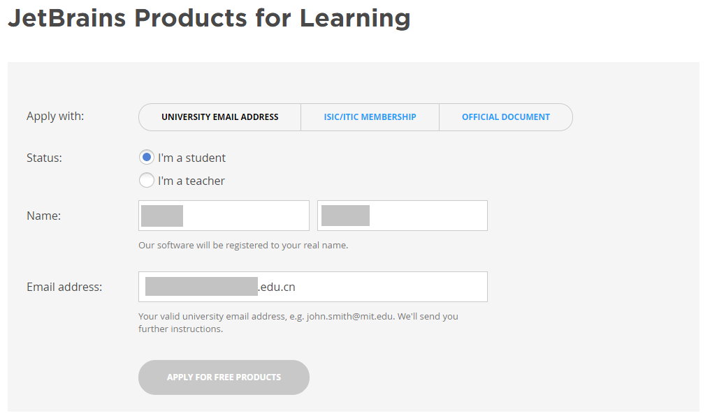
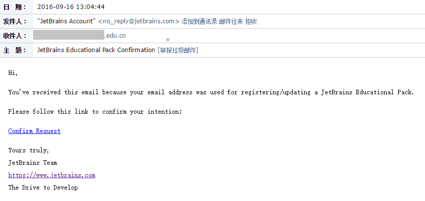
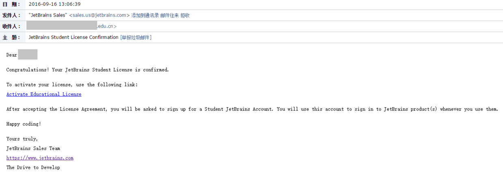
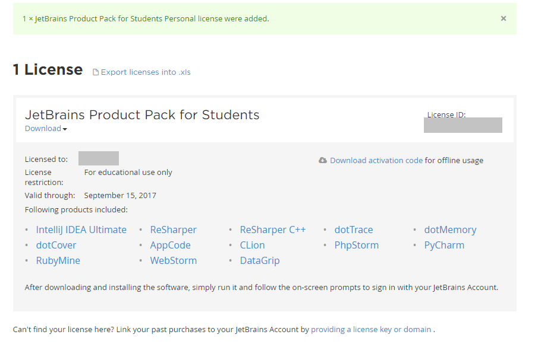
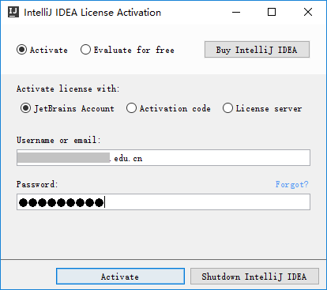
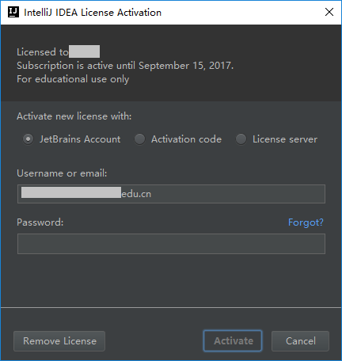

IntelliJ 作为一款强大的 Java 开发 IDE，售价自然也不会低。但是对于学生或教师来说，JetBrains 开发工具免费提供给学生和教师使用。而且取得一次授权后只需要使用相同的 JetBrains 帐号就可以激活其他产品，不需要重复申请。

# 个人申请步骤如下：

1. 打开 [申请页面](https://www.jetbrains.com/student/) ，点击 “APPLY NOW” 开始申请。

2. 填写姓名，以及学校提供给你的邮箱（邮箱地址要 edu.cn 结尾）

3. 下一步后，进入邮箱查看（如果收件箱没有找到，请查看是否为误判丢进了“垃圾邮件”）

4. 点击 “Confirm Request” 进行确认，打开的网站会提示你注册 JetBrains 账号，输入账号与密码后，再次确认。

5. 回到邮箱，刷新，此时点击 “Active Educational License”

6. 成功的获得授权码。

7. 官网下载开发工具，以 IntelliJ 为例（注意下载[**Ultimate版本**](https://www.jetbrains.com/idea)），[2016.3.4版本直接下载地址](https://download.jetbrains.8686c.com/idea/ideaIU-2016.3.4.exe)在此。

8. 可以直接通过之前注册的 JetBrains 帐号激活产品。

9. 激活完成，Help->Register验证。

# 注意：

1. 申请的 Lisence 有效期为一年，在到期后，可以去官网重新认证。
2. 一个 Lisence 可以在多台设备验证，但同时使用的只能为1台，**[参考网站](https://sales.jetbrains.com/hc/zh-cn/articles/206544319-%E6%88%91%E5%8F%AF%E4%BB%A5%E5%9C%A8%E4%B8%A4%E9%83%A8%E4%B8%8D%E5%90%8C%E7%94%B5%E8%84%91%E4%B8%8A%E4%BD%BF%E7%94%A8%E6%88%91%E7%9A%84%E4%B8%AA%E4%BA%BA%E6%8E%88%E6%9D%83%E5%90%97-)**。
3. [**更多的学生优惠资源**](https://github.com/ivmm/Student-resources/)在此。
4. 最后，引用第3条中作者的一句话，“希望各位享受权利的同时不要忘记自己的义务，不要售卖、转手自己的学生优惠资格，不要作践自己作为学生的价值”，谢谢！