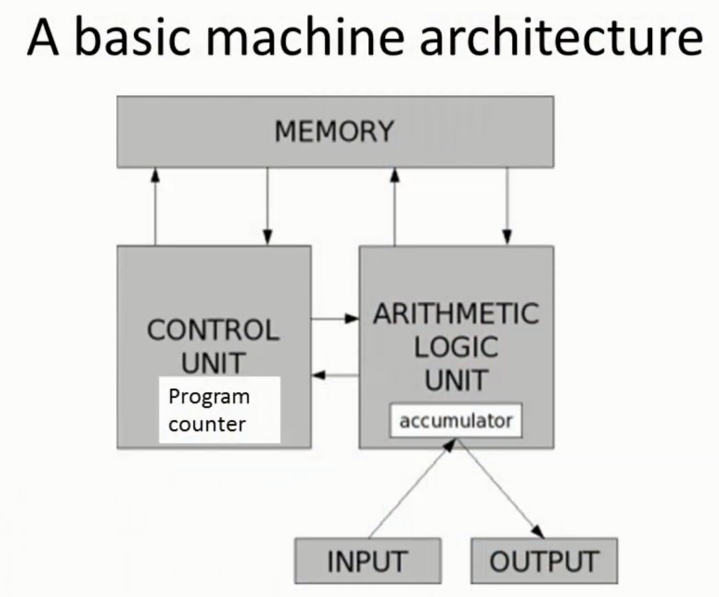

计算机科学及编程导论在 MIT 的课程编号是 6.00.1，是计算机科学及工程学院的经典课程。之前，课程一直使用 Scheme 作为教学语言，不过由于 Python 简单、易学等原因，近年来已经改用 Python 作为教学语言了。（[更多介绍](http://codingpy.com/article/mit-ocw-introduction-computer-science-using-python/)）

最初知道这个课程的时候大概是在 2014 年，对于做事拖沓的我，这门课程已经从低清随堂录制变成了 edX 平台的一门 高清的 MOOC，转眼间已经大三，希望自己能够完成自己曾经定下的计划。以下是在我在学习本课程时的一些笔记，在此与大家共享、共勉。

## What does a computer do?

+ Fundamentally a computer:
    - Performs some calculations
    - Remembers results

+ What calculations?
    - Built in primitives
    - Creating our own methods of calculating

Simple calculations are not enough, so good algorithm design also needed to accomplish a task.

Despite its speed and storage, a computer does have limitations

+ Some problems still too complex
+ Some problems are fundamentally impossible to computer (e.g. Turing's Halting Problem)

---

## Knowledge
+ Declarative
+ Imperative (likes a recipe, "how-to")

## Computers
+ Fixed-program computers (earliest computers)
    To solve specific problems
    - Atanasoff (1941) - linear equations
    - Turing bombe
+ Stored-program computers
    
+ Program is a recipe. Each programming language provides a set of primitive operations.
+ Given a fixed set of primitives, a good programmer can program anything.
+ Anything you can do with a language, you can do with another.

## About python
+ High(✅) vs. Low
+ General(✅) vs. Targetted
+ Interpreted(✅) vs. Compiled

## Aspects of languages & Common Errors

| Aspects | Description |
| ------ | ---------- |
| Primitive constructs | numbers, strings, simple operators |
| Syntax | which strings of charactres and symbols are well-formed |
| Static semantics | which syntactically valid strings have a meaning |
| Full semantics | what is the meaning associated with a syntactically correct string of symbols with no static semantic errors |

+ 语法用来描述语言中，什么表述是合法的。 
+ 静态语义表示什么程序是有意义的，哪种表达是有意义的。 
+ 完整语义即程序想达到什么目的，运行程序会产生什么效果。

## Goal
+ Learn the syntax and semantics of a programming language.
+ Learn how to use those elements to translate “recipes” for solving a problem into a form that the computer can use to do the work for us.
+ **Computational modes of thought enable us to use a suite of methods to solve problems.**

## References
+ [MIT麻省理工学院公开课：计算机科学及编程导论 Python 笔记1-3](http://blog.csdn.net/muzilanlan/article/details/45749823)
+ [麻省理工公开课《计算机科学及编程导论》中文笔记（第1讲）](http://blog.csdn.net/xiaowanggedege/article/details/7939853)
+ [【MIT计算机科学与编程导论】打卡及笔记](https://www.douban.com/group/topic/35109573/)