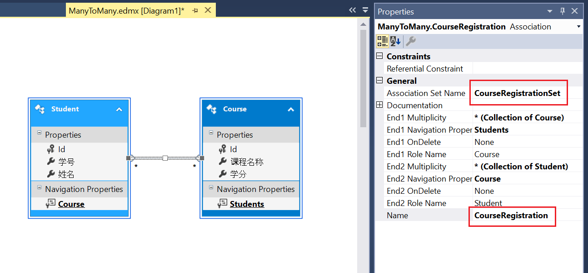
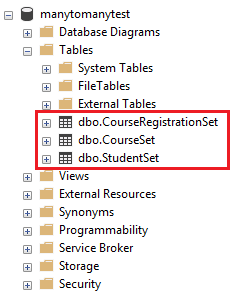
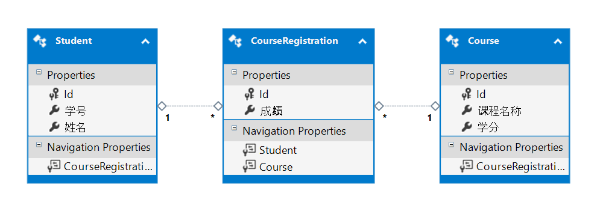
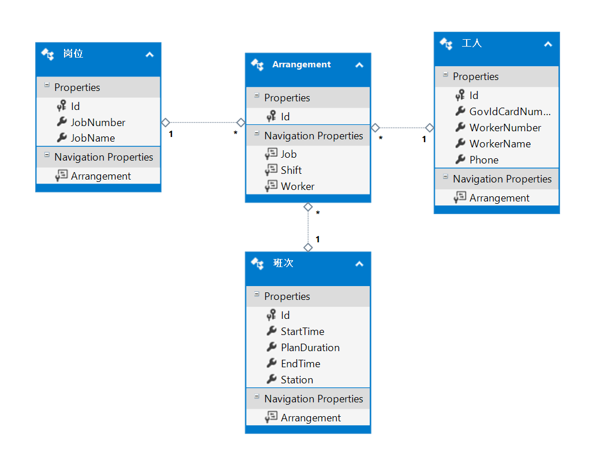

## 介绍

在之前的 [Entity Framework 快速上手介绍](http://www.cnblogs.com/hiwangzi/p/EntityFrameworkSample.html) 之中，两个实体之间只是简单的一对一关系，而在实际的应用场景中，还会出现多对多关系，同时还有可能会出现多对多关系还附带有其他字段的情况。

下面以几个例子，对**表间多对多关系的类表示**加以更加详细地描述。虽然两个场景举例是使用的 C# 及 Entity Framework(Model First) 框架自动生成数据库、实体类。但这种设计方法，并不只是在使用 ORM 框架时需要，事实上，它是 POCO 及简单 Java 类（POJO）的设计原则之一。


## 场景实例

### 场景一

在考虑多对多关系还附带有字段的情况之前，让我们先看一下，多对多关系但不附带额外字段的情况下，实体类代码的表示。

此处使用 Entity Framework(Model First)，快速将 model diagram 转为数据库中的表及实体类。

假设的场景是学生选课，一名学生可以选多门课，一门课也可以被多个学生选择。E-R 图如下所示：


对应自动生成的数据库如下：



- StudentSet
    
- CourseSet
    
- CourseRegistrationSet
    
    * 其中 `Course_Id` 与 `Students_Id`（注：此处词尾(s)负数的原因参见上面 E-R 图中右边的 `Properties` 中 `End1 Navigation Property` 的设置）分别以另外两张数据表的 `Id` 主键作为外键。
    * 同时 `Course_Id` 与 `Students_Id` 两者联合做 `CourseRegistrationSet` 表的主键。

对应自动生成实体类的代码如下：
- Student.cs
    ```cs
    namespace Model
    {
        using System;
        using System.Collections.Generic;
        
        public partial class Student
        {
            [System.Diagnostics.CodeAnalysis.SuppressMessage("Microsoft.Usage", "CA2214:DoNotCallOverridableMethodsInConstructors")]
            public Student()
            {
                this.Course = new HashSet<Course>();
            }
        
            public int Id { get; set; }
            public string 学号 { get; set; }
            public string 姓名 { get; set; }
        
            [System.Diagnostics.CodeAnalysis.SuppressMessage("Microsoft.Usage", "CA2227:CollectionPropertiesShouldBeReadOnly")]
            public virtual ICollection<Course> Course { get; set; }
        }
    }
    ```
- Course.cs
    ```cs
    namespace Model
    {
        using System;
        using System.Collections.Generic;
        
        public partial class Course
        {
            [System.Diagnostics.CodeAnalysis.SuppressMessage("Microsoft.Usage", "CA2214:DoNotCallOverridableMethodsInConstructors")]
            public Course()
            {
                this.Students = new HashSet<Student>();
            }
        
            public int Id { get; set; }
            public string 课程名称 { get; set; }
            public string 学分 { get; set; }
        
            [System.Diagnostics.CodeAnalysis.SuppressMessage("Microsoft.Usage", "CA2227:CollectionPropertiesShouldBeReadOnly")]
            public virtual ICollection<Student> Students { get; set; }
        }
    }
    ```

#### 分析
+ 数据库表之间一对一、一对多的关系在代码中是通过 **对象引用** 或 **对象数组/List等形式的引用** 实现的。
+ 从实例中可以看出，CourseRegistrationSet 表中的多对多关系在代码中的表现形式同样是实体类中的 **对象List等形式的引用**，只不过多对多关系是**多个实体类中都存在其他实体类对象List的引用**。

### 场景二

现在让我们增加一个需求，实际应用之中，数据库不可能仅仅存储某学生选了某门课程这些信息，同时还需要保存选课时间、操作人、成绩等等信息。

现在让我们为 `CourseRegistrationSet` 表增加一个字段——成绩。

- CourseRegistrationSet


同时我们需要更新一下程序中的代码，这时候问题出现了🙄：两个实体类中互相存储着对方**对象List**的引用，成绩字段该放到哪里呢？

此时我们换一种思路，如果将 `CourseRegistrationSet` 同样想象为一种特殊的实体，那么就可以实现将 `Student` 与 `Course` 关联的同时，还可以保存**成绩**信息。即如下图所示：



如果你刚刚仔细阅读了 Entity Framework(Model First) 自动生成的 **数据库表结构** 以及 **类的代码**，再结合上面新的 E-R图，大概也就可以明白，应该如何在代码中表示多对多关系（附带额外字段/属性）。

上面的场景生成的数据表结构如下：

- StudentSet
    
- CourseSet
    
- CourseRegistrationSet
    

自动生成的实体类的代码：
- Student.cs
    ```cs
    namespace Model
    {
        using System;
        using System.Collections.Generic;
        
        public partial class Student
        {
            [System.Diagnostics.CodeAnalysis.SuppressMessage("Microsoft.Usage", "CA2214:DoNotCallOverridableMethodsInConstructors")]
            public Student()
            {
                this.CourseRegistration = new HashSet<CourseRegistration>();
            }
        
            public int Id { get; set; }
            public string 学号 { get; set; }
            public string 姓名 { get; set; }
        
            [System.Diagnostics.CodeAnalysis.SuppressMessage("Microsoft.Usage", "CA2227:CollectionPropertiesShouldBeReadOnly")]
            public virtual ICollection<CourseRegistration> CourseRegistration { get; set; }
        }
    }
    ```
- Course.cs
    ```cs
    namespace Model
    {
        using System;
        using System.Collections.Generic;
        
        public partial class Course
        {
            [System.Diagnostics.CodeAnalysis.SuppressMessage("Microsoft.Usage", "CA2214:DoNotCallOverridableMethodsInConstructors")]
            public Course()
            {
                this.CourseRegistration = new HashSet<CourseRegistration>();
            }
        
            public int Id { get; set; }
            public string 课程名称 { get; set; }
            public string 学分 { get; set; }
        
            [System.Diagnostics.CodeAnalysis.SuppressMessage("Microsoft.Usage", "CA2227:CollectionPropertiesShouldBeReadOnly")]
            public virtual ICollection<CourseRegistration> CourseRegistration { get; set; }
        }
    }
    ```
- CourseRegistration.cs
    ```cs
    namespace Model
    {
        using System;
        using System.Collections.Generic;
        
        public partial class CourseRegistration
        {
            public int Id { get; set; }
            public string 成绩 { get; set; }
        
            public virtual Student Student { get; set; }
            public virtual Course Course { get; set; }
        }
    }
    ```

#### 分析
+ 数据库表之间多对多的关系在代码中表示需要将“多对多关系”同样抽象为“实体”来实现。但仍然是通过 **对象引用** 或 **对象数组/List等形式的引用** 实现的。
+ 从实例中可以看出，`Student` 与 `Course` 之间原本**直接**的多对多关系被转换成了：
    - `Student` 与 `CourseRegistration` 的一对多关系
    - `Course` 与 `CourseRegistration` 的一对多关系
    - `CourseRegistration` 与 `Student`, `Course` 的一对一关系

## One more thing...（事实上是主题相关的更多内容）

在前段时间的实习期间设计数据库时，两次遇到这个问题；同时前段时间在一次上机考试中，又遇到了这个问题。

+ 第一次时，没有找到合适的相关资料，同时秉持着一个现在看来并不恰当的信念：“实体类对应实体表”。因此，解决方法比较粗暴，当时直接将额外字段加到了某一张表之中。下面是当时的情景：（括号中为对应于上面的案例）
    - 工人（学生）拥有（选课）技能（课程），额外需要一个字段表示工人对技能的熟练程度（成绩）。
    - 看起来和上面的场景二就是一模一样呀🙃然而当时我并没有想到场景二中的解决方法，而是把“工人对技能的熟练程度”这个字段加到了技能表中。还算幸运的是，技能熟练程度只分为三个级别。

+ 那段时间，又恰巧碰到了一门考试，遇到了同样的问题，然后正在上机考试的我，突发奇想地想到了这个办法来解决这个问题。但当时设计的类同样**存在缺陷**。
    - 题目描述：
        * 设计一个机票销售网站提供机票在线销售功能。客户登录系统后，可以查看航班列表，以及剩余机票数量，可以进行机票的购买，可以查看已购机票情况，对已购机票在规定的日期期限内可以退票。
    - 数据库要求：
        * 客户表(Id, 身份证号, 姓名, 电话, 密码)
        * 机票表(Id, 航班号, 起飞时间, 价格, 剩余数量)
        * 机票购买表(Id, 客户Id, 机票Id, 购票日期, 退票标志, 退票日期)
    - 我的实体类设计（Java, 此处省略 getter, setter）：
        * Client.java
        ```java
        public class Client {
            private int id;
            private String govNumber;
            private String fullName;
            private String phoneNumber;
            private String password;
            private List<Ticketing> ticketingList;
        }
        ```
        * Ticket.java
        ```java
        public class Ticket {
            private int id;
            private String flightNumber;
            private Date takeOffTime;
            private double price;
            private int avaliable;
            private List<Client> clientList;
        }
        ```
        * Ticketing.java
        ```java
        public class Ticketing {
            private int id;
            private Client client;
            private Ticket ticket;
            private Date ticketingDate;
            private int cancelRemark;
            private Date cancelDate;
        }
        ```
    发现我当时的问题出在哪里了么？如果找到了，欢迎在评论区留言哦~😀（我就先不明说咯，逃

+ 第三次遇到此问题
    - 自认为此次解决方法算是符合业界规范 😂 如果文章中有什么错误之处，烦请指出，感谢。
    - 如下图所示，通过 Arrangement 实体连接其他三个实体。
    