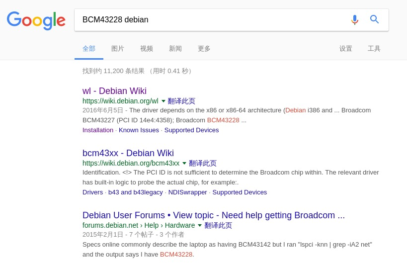

我的 PC 型号是 Acer V3-572G，安装了 Debian 后，发现只能通过有线网络上网，无法识别无线网卡，以下是解决的过程(不局限于此型号 PC):

* 在命令行键入 ```lspci``` ，得到网卡型号「BCM43228」
    ```shell
    xox@debian-x64:~$ lspci

    00:00.0 Host bridge: Intel Corporation Haswell-ULT DRAM Controller (rev 0b)
    00:02.0 VGA compatible controller: Intel Corporation Haswell-ULT Integrated Graphics Controller (rev 0b)
    00:03.0 Audio device: Intel Corporation Haswell-ULT HD Audio Controller (rev 0b)
    00:14.0 USB controller: Intel Corporation 8 Series USB xHCI HC (rev 04)
    00:16.0 Communication controller: Intel Corporation 8 Series HECI #0 (rev 04)
    00:1b.0 Audio device: Intel Corporation 8 Series HD Audio Controller (rev 04)
    00:1c.0 PCI bridge: Intel Corporation 8 Series PCI Express Root Port 3 (rev e4)
    00:1c.3 PCI bridge: Intel Corporation 8 Series PCI Express Root Port 4 (rev e4)
    00:1c.4 PCI bridge: Intel Corporation 8 Series PCI Express Root Port 5 (rev e4)
    00:1d.0 USB controller: Intel Corporation 8 Series USB EHCI #1 (rev 04)
    00:1f.0 ISA bridge: Intel Corporation 8 Series LPC Controller (rev 04)
    00:1f.2 SATA controller: Intel Corporation 8 Series SATA Controller 1 [AHCI mode] (rev 04)
    00:1f.3 SMBus: Intel Corporation 8 Series SMBus Controller (rev 04)
    01:00.0 Unassigned class [ff00]: Realtek Semiconductor Co., Ltd. RTL8411B PCI Express Card Reader (rev 01)
    01:00.1 Ethernet controller: Realtek Semiconductor Co., Ltd. RTL8111/8168/8411 PCI Express Gigabit Ethernet Controller (rev 12)
    02:00.0 Network controller: Broadcom Limited BCM43228 802.11a/b/g/n
    03:00.0 3D controller: NVIDIA Corporation GM108M [GeForce 840M] (rev a2)
    ```

* 使用搜索引擎得到特定型号的固件包

如下图，第一个搜索结果中即有相关信息 [wl - Debian Wiki](https://wiki.debian.org/wl)



* ```apt-get install``` 安装驱动
    ```shell
    # apt-get update
    # apt-get install linux-image-$(uname -r|sed 's,[^-]*-[^-]*-,,') linux-headers-$(uname -r|sed 's,[^-]*-[^-]*-,,') broadcom-sta-dkms
    ```

* 重启即可使用无线网络