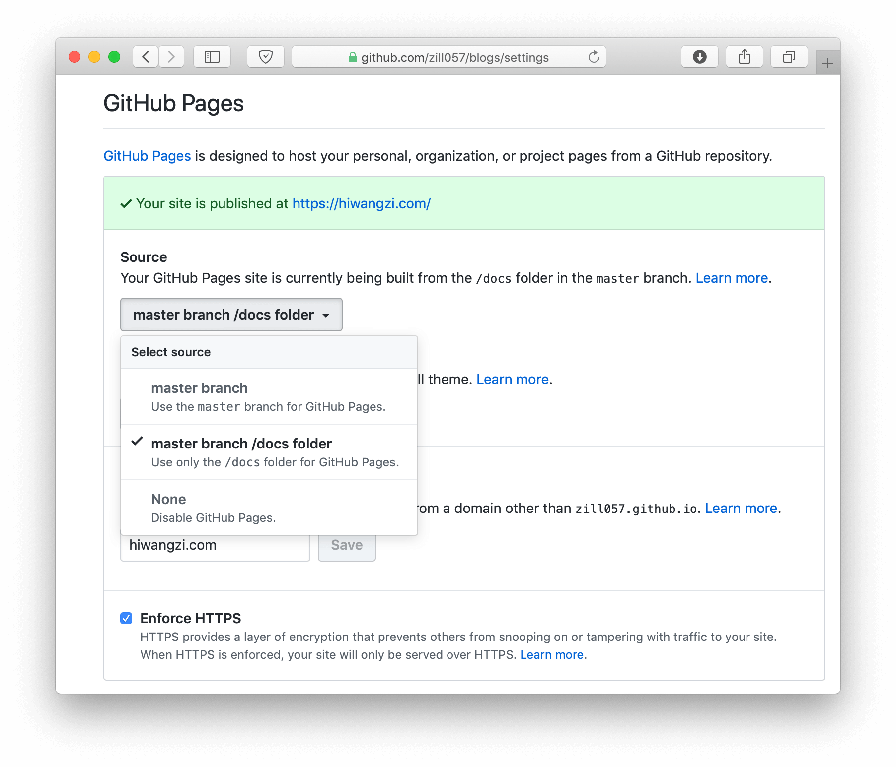

因为切换了博客生成器，**订阅地址发生了变化**，请订阅 [新地址](https://hiwangzi.com/index.xml)。

昨天晚上开始折腾将 Hexo 替换为 Hugo 来生成博客，以下是关于我对于 Hugo 的一些配置。

* 修改 `archetypes/default.md`，默认模版增加了 `summary`、`tags` 字段。
* 建立 [`config` 目录](https://github.com/zill057/blogs/tree/15cf97bf639312217d719493915c0f05d46d0797/config)代替原有的 `config.toml`，根据[官方文档说明](https://gohugo.io/getting-started/configuration/#configuration-directory)，创建了默认（均先加载该配置，然后加载其他配置）以及两个环境下的配置目录（`development`、`production`）。这样就可以实现默认情况下 `hugo server` 调用 `development` 配置，`hugo` 调用 `production` 配置。
* 通过 Git 子模块的形式，引入主题 [tale](https://themes.gohugo.io/tale-hugo/)，根据主题的文档说明，做了如下操作：
  * [覆盖了部分页面配置](https://github.com/zill057/blogs/tree/15cf97bf639312217d719493915c0f05d46d0797/layouts)，目的是自定义菜单栏、加载 Disqus 评论插件。
  * [覆盖了 favicon 静态资源](https://github.com/zill057/blogs/tree/15cf97bf639312217d719493915c0f05d46d0797/static)，实现自定义站点 icon 图标。
* 通过修改配置文件，将生成结果放置到 `docs` 目录下。这样可以通过配置 GitHub 项目的 Pages 获取方式，来实现页面的渲染。
    
* 通过 Hugo 的 [taxonomies 机制](https://gohugo.io/content-management/taxonomies/)，实现标签。

### 感受

* 比起 Hexo，Hugo 的速度真的快很多。
* 项目中可以摆脱复杂的 npm 依赖，也可以减少一个系统级的 npm 包。
