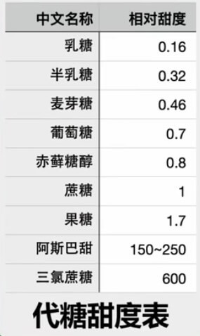
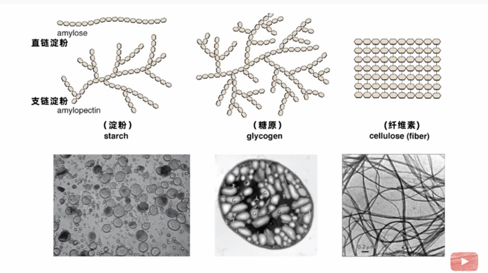

最早发现糖中的碳、氢、氧比例都如下，所以把糖也称为碳水化合物（后来发现一些糖也并非这个比例）

$$
\ce{ Cn(H2O)m }
$$

## 单糖

$$
\ce { C6(H2O)6 }
$$

- 可以被人体直接吸收
- 常见：葡萄糖、果糖、半乳糖
- 葡萄糖 + 氧气 → 水 + 二氧化碳 + 能量
- 葡萄糖 → 乳酸 + 能量 （酸奶）
- 葡萄糖 → 酒精 + 能量 （酿酒）

## 二糖

$$
\ce { C12(H2O)11 }
$$

- 常见：麦芽糖、蔗糖（最常见）、乳糖
    - （脱去1分子水）葡萄糖 + 葡萄糖 = 麦芽糖 + 水
    - （脱去1分子水）葡萄糖 + 果糖 = 蔗糖 + 水
    - （脱去1分子水）葡萄糖 + 半乳糖 = 乳糖 + 水
- 二糖可以水解，然后被人体吸收

## 代糖

- 不一定是糖，只要一点点就很甜

## 多糖

- 碳原子超过100个
- 常见：
    - 水解：淀粉（大米、白面）→ 半糖
    - 糖原     ←(合成/分解)→    单糖     -(合成)→    脂肪
    - 纤维素：木头、棉花、蔬菜、粗粮
    - 几丁质：甲壳动物的壳

## 参考

- [“元气森林”真的没有糖吗？人类为什么喜欢吃糖？ - YouTube](https://www.youtube.com/watch?v=sNQ8uAAIHnc)
