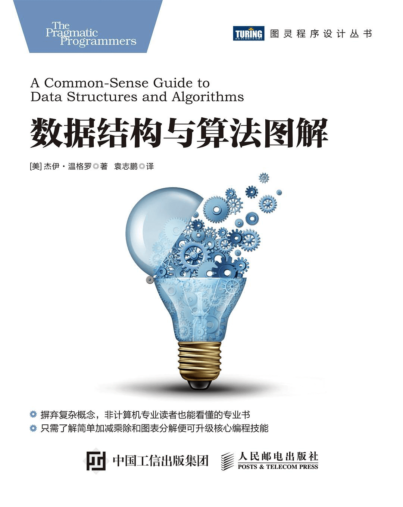

距离2021结束还有2个多小时，此刻的我已经昏昏沉沉，眼皮耷拉。

或许是只有近期才会记忆深刻，或许是上半年确实没什么值得记忆，只有最近几个月的事还留在脑海中。



虽然2021里也没有什么特别值得述说的故事，但心态还是有所成长，尤其是在和亲密的人产生争执独处的日子里。或许是开心的日子，就迷迷糊糊一不留神，就从指尖溜走；又或许是那些快乐也只是庸人的傻乐。但总之，2021让我真正再次审视自己是发生在最后的两个月里。

以下是12月月初写下的文字：

> 2021年，最后30天，即将跟25岁告别，还是挺恍惚的，一个数字就这样到了自己的眼前。
>
> 前段时间看的一期圆桌派，窦文涛讲到，重大的心态改变或者说人生转变，都是发生在旅途中，或者是突然出现的意外后。大意是说，只有当自己独处之时，才会真正地思考自己。
>
> 那最近这段日子，或许就属于我的这个阶段吧。
>
> 历史上自己想做过的事情很多，而真正做成的事情寥寥无几，仿佛生命无限长，总是能有那么一个未来，成为自己想象中的自己。以上这种想法也并不是第一次才想到，之前每次的结论都是相似，在“要从现在开始珍惜每一天，认真做事，过好每一天”这样的话语下，继续在一天天的生活和无痕的时光里，沉湎。
>
> 而这次，感觉似乎有那么一些不一样。此刻的我，开始觉得，生活或许就是这样，值得纪念的日子总是少数。之前总是崇尚于宏大话题，忘记了宏大是由一点点小事构成的，反复提及宏大，或许只是因为从未迈开过第三步，第一步壮志凌云，第二步咬牙切齿，然后，就没有然后了。
>
> 何苦迷恋于自己心中的完美呢。60分OK，80分很棒，总会有日子，成为值得纪念的某天。
>
> 不过，切实可行的目标，还是要有的，希望在这2021年的尾巴里，做成以下几件事：
>
> 1. 再减重5KG Target: 82KG
> 2. 读完《Java编程的逻辑》
> 3. 学完《赖世雄音标》
> 4. 读完《Animal Farm》
>
> 谨此。以上。

那现在，要对自己做一个汇报。

在汇报开始之前，要纠正上文中的一个高预期错误，希望做成的第一件事中的82KG就是加倍之后的要求，11月30日的体重是89KG，所以实际目标应该为84KG。对于目标，总是盲目乐观，是自己的一个问题，希望在2022年，能慢慢调整这一点。至少，目标估计得要准确一些。

对了，还有自己在这段时间里，想到了「自己为什么不喜欢打游戏」这个问题的答案。是因为自己总想成为一个天赋者，总希望自己能被大家道出 wow。然而现实是，我在知道自己是不是所谓天赋者的反面之前，就因为不能实现这个高高的目标，在笨拙之中离开，似乎使自己保留了一种体面。然而现在意识到之后，很想对当时的自己说，「大可不必，没有那么多聚光灯投射在身上，做自己就好了。而且终有一天，你会说出『I don’t give a shit』」。



虽然目标1没有达成，但11月开始的努力还是力挽狂澜，控制住了发福K线图😂

目标2《Java编程的逻辑》这本书也没读完，在阅读过程之中，发现还是需要再复习一下数据结构与算法，就开始看《数据结构与算法图解》了。

目标3可以说初步完成，但是后半部分的辅音，尤其是这 [ʒ] [n] [ŋ] [l] 四个，对我来说很难，还是需要再多多练习。

目标4在12月14日时，决定放到元旦之后进行。

总结一下，40%的完成率是有的，对于自己还是一个可以接受的结果。虽然过程不总是如意，但有计划指导，还是好过前半年的得过且过。







对于2022年，我的愿望/目标：

- [ ]  精进技术，读完之前列的书单
- [ ]  学好英语，能够真正地使用使用这门语言
- [ ]  体魄健壮，生活能够更加健康（80KG以下、每天有效睡眠8小时、吃得健康自律）

那再来2个小目标吧：

- [ ]  读书12本（4本英文书）
- [ ]  跑量达到365✖️2 = 730KM

不管如何，最重要的是认真生活。愿我的朋友们、家人们，愿每个人，都有自己喜欢的生活！