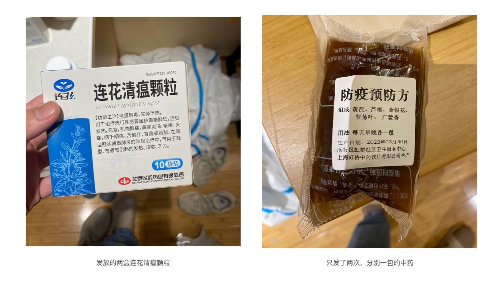
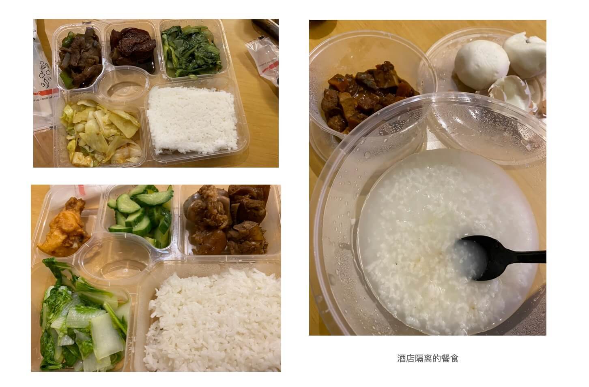
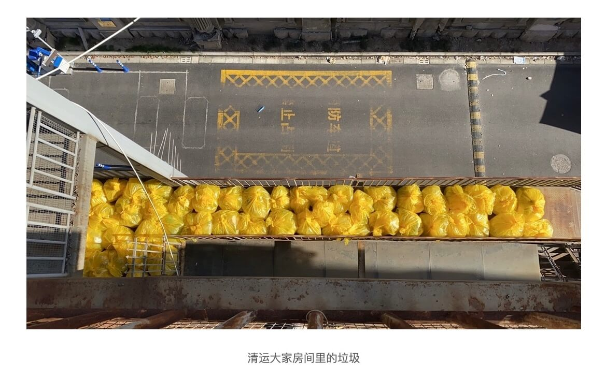
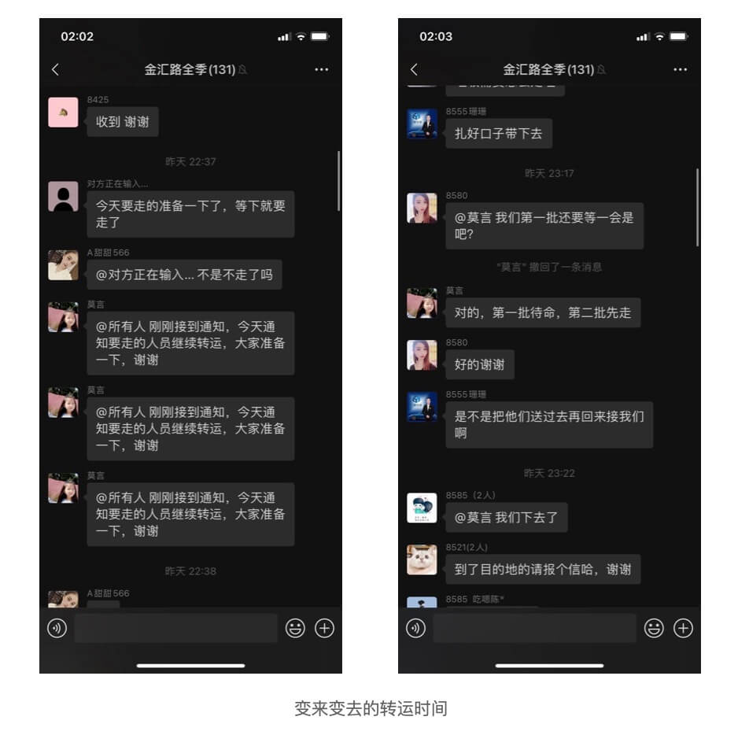
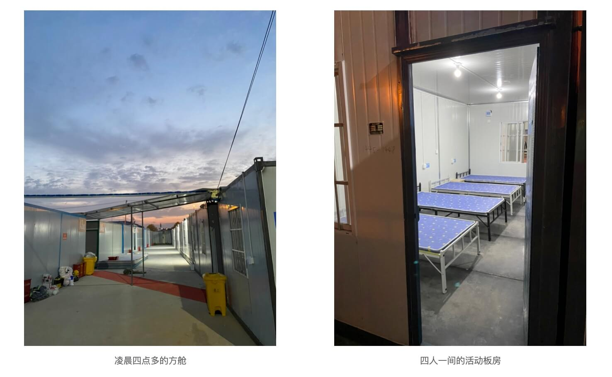
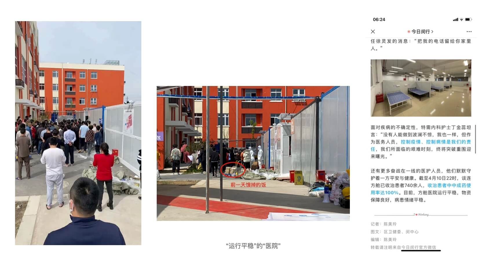
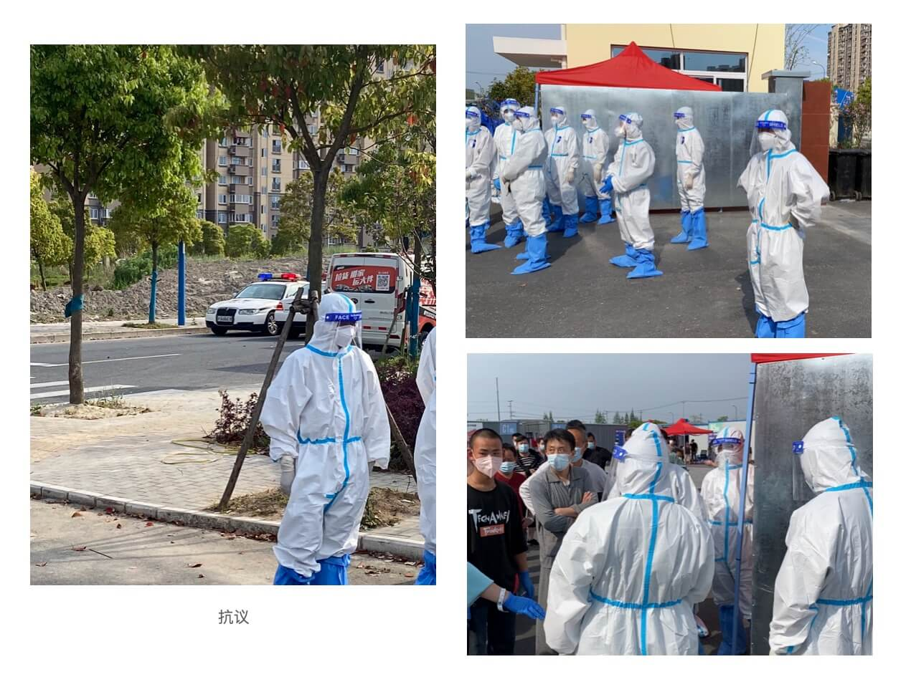
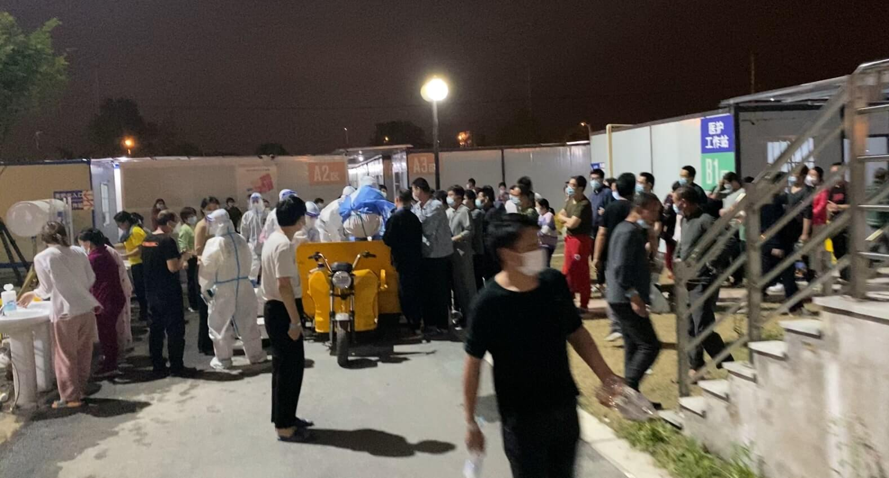
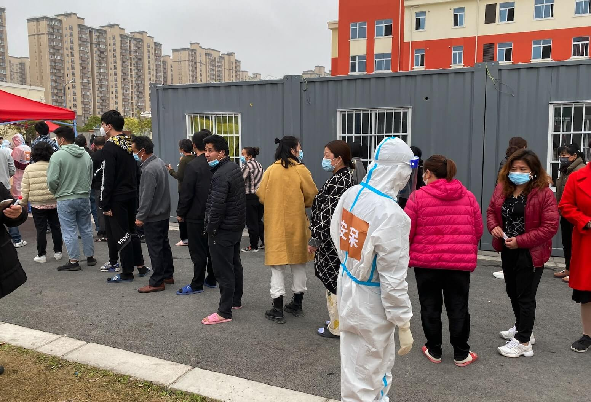
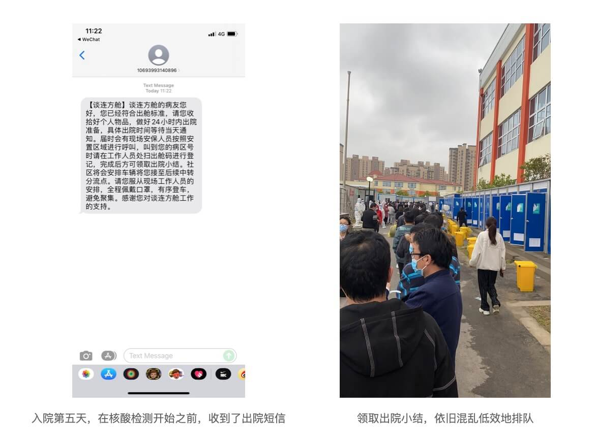

## 发热

居住的小区在3月18日就开始封闭，在新冠确诊之前，已经经历了十次左右核酸检测。对于如何感染上新冠病毒这件事，如今只能猜测核酸检测时密集接触，或是快递包裹上带有病毒。

## 酒店

我是4月3日晚上10点多被拉去酒店隔离的，在酒店6天没见到防疫人员，只有一个酒店工作人员在微信上负责对接。酒店只有4层、5层，我是在4层和女朋友一起隔离。

虽然没有明确的后续流程告知，但是酒店里，条件还是比较好的，至少能保证一家人或者单人一间隔离，大家也都比较谨慎，在我们几个自发的志愿者提醒下，基本没有出门走动的，饭的话是由安保大白送到楼上，再由我们几个志愿者分发到房间门口。志愿者里有位大叔非常热心，向酒店申请了喷壶、消毒药片，在酒店4层，算上我总共有4人做志愿者，两人负责做走廊消杀，两人负责发放餐食、物资。在每次活动前，我们都互相先把身上喷一下消毒水，戴好医用手套。个人觉得，在酒店里，应该不少人都已经转阴了。

关于消毒药片有个小悲剧，我们在把消毒药片发到房门口后，在群里发文字跟大家说，这个是放到马桶水箱里面的。但可能又是因为消毒药片和一小袋中药是一起发放的，有位阿姨不识字，误服了消毒药片，在10点多赶紧拨打了120送去急救。内心当时非常难受，觉得愧疚万分。后续在群里发的各种消息，改成了语音发一遍，文字再发一遍的形式。

酒店的几天里，很多人也都询问何时做核酸，但是也没有得到答复。到了9号下午，在我们几个志愿者清运完各个房间的垃圾之后（进入酒店第二天发放的黄袋子，要一段时间，才会统一清运一次）。回到房间后，我看到酒店工作人员在群里发了一个名单，通知转运第一批人，让大家收拾好，但是没有通知去哪里。

到了晚上，又通知先不转运，第二天再转运。然后我就先去睡了，到了10号凌晨2点，被外面一阵敲打声吵醒，也不知道是什么声音，看了一下手机，才发现，10点的时候，酒店工作人员又通知说，大家快做好准备，要出发了，同时发了一个第二批转运的名单。在凌晨2点我醒了的时候，才发现，第二批名单已经先行转运走了（也就是说，第二批名单上的人，被临时通知没几个小时，在不知道目的地的情况下，就出发了）。

没在这两批名单的人就很紧张，觉得在酒店隔离可能已经转阴，害怕去了方舱再次被传染，有人提议一起去12345登记投诉。后续他们就在酒店做抗原、核酸检测了，虽然到了方舱的第二天看到这个消息，也有不满，但发现后面新进入酒店的感染者多是老人、儿童，心里还是比较支持的了。

作为第一批名单的人，最终接到的消息是等待大巴把第二批名单的人送到后，会回来再接。此时我们只能盼着，方舱医院不要太混乱，至少大家在酒店的隔离都是小心谨慎。

## 方舱

应该是3点左右吧，开始通知第一批名单的人下楼，到了车上，又等了半个多小时，所有人才到齐（一些人跟我一样，早早睡下了，没看到消息）。

快到五点，终于到了方舱医院，在一位早到的病患指导下，去空病房抱了被子回到床位，就躺下尝试休息了。在四人一间的活动板房里，听着此起彼伏的呼噜声，熬到了6点多，天亮了。

早饭的混乱打破了我的幻想，大白把之前馊了的盒饭，误当作早饭发放，随后运来的早饭，大白往那边一放，一群人发生了哄抢。再加上大家不戴口罩的聚集洗漱，让我都觉得在酒店时的小心翼翼是种“荒唐”。

经过早餐的混乱，再次形成了靠病患自己组织成的志愿者分发餐食的秩序。

虽然看着“今日闵行”公众号写着“物资保障良好”，但是我在方舱的几天里，在我后面来的一批病患，一直没拿到过洗漱用品，再加上前三天的高温天气，感觉他们真的难过。还有就是总共1500人左右的方舱，只有三台净水器能够打热水，每次接热水都是排长龙。（PS：我在隔离前，所幸是收拾了一堆东西去的，包括电热水壶）。

前三天，每天1人只有1瓶矿泉水。这三天里，志愿者们多次找大白反馈物资问题，可得到的答复总是已向上面反馈，可天知道，这上面到底是谁。在第三天下午，我在教室避暑的时候，突然听到外面跑过一群人，一阵喧闹，过了一会儿出去看，发现是最初牵头的志愿者，实在是无法忍耐，和大白们起了冲突，到了大门口，打开大门，跑到了门外，大白尝试关门，我们把他拉了进来，让大门开着。现在想来，也实在惊险，如果只是他个人被关在门外，怕是要被扣上一个破坏防疫的罪名了。

在两辆警车依次来到之后，又来了一辆满载身着防护服的特警的车辆。这里不细说了，只说最后结论，依然没有一个方舱医院的负责人露面，只有一名警官负责协调，反馈了三天无法解决的喝水问题，最终方案是当天下午会再送来一批矿泉水，烧水壶会之后解决，并且除三餐外，会增加水果酸奶。

和我想的不同，本以为这样方舱医院步入正常运营的正轨，但是在大白咨询了上级领导矿泉水发放方式后，让大家自己去拿，随后又一波哄抢发生了。后来改为排队领取，再次群体密集聚集。

抗议的第二天（入院的第四天）早上的核酸检测，大白们依然无组织，直接通知全员做核酸，先需要排队找核酸贴纸，再是排队去做检测，真的是失望……明明可以按照之前的形式，分病区做检测，但就是没有人愿意把事情做好，就变成了“**有决定权的人不做事（或者说也根本不在乎效率、科学与防疫），做事的人没有决定权（同时也没有主观能动性）**”。

入院的第五天，实在看不下去依旧混乱，我提前去护士站找护士要来了我所在病区的核酸检测贴纸和试管（护士站其实也按病区已经提前分好了贴纸，但不知道为什么前一天会无序排队），发到了每个房间，让大家等会儿人少一些，再去排队。

再次混乱无序的排队领取出院小结，虽然明明出院小结是按照病区、床号顺序已经打印好，只要按照病区来叫，会很快的分发完毕，但发放形式依然是通知大家出来排队领取……这个时候我已经无力吐槽了。

然后也不意外，出院登车也是依旧混乱，一边在排队领出院小结，另一边在等待排队登车。虽然出院前大家都已经扫码登记了出院目的地，但依然不采用提前按目的地（镇或街道）分批排队登车的形式。最后各辆大巴上，平均目的地要跑5、6个镇。所有人都很累，病患、大白、司机、镇上分流点等待的工作人员……但所有人却都主动或被动地选择了这种方式。

深夜，大巴车继续在空荡的街道上缓缓前行……

## 感谢

感谢酒店里名为“莫言”的工作人员，尽可能地帮助协调各种问题！

感谢各位病患志愿者，大家都在尝试，让这个世界尽量少一些糟糕！

感谢各位医护人员，各位大白，虽然我对你们的工作模式多有不满，可前三天里最高31度的高温下，防护服下的你们也的确辛苦！

### 再补几张照片













哦，对了还有，方舱里也是没有药的，只有入院时发放的两盒连花清瘟颗粒，我因为没什么症状，也就没有吃。倒是看到两次，有人去找护士索要治疗腹泻的药，护士跟他说让他如果拉肚子，就不要再继续吃连花清瘟了。